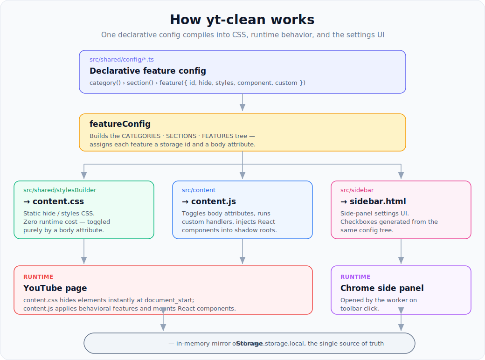

<h1 align="center">YouTube Clean</h1>

<p align="center">
  A browser extension that declutters YouTube — hide Shorts, ads, and sidebar
  items, simplify the player and feed, and add handy controls like a playback
  speed slider, all toggled from a side panel.
</p>

<p align="center">
  <a href="https://chromewebstore.google.com/detail/dnglnblikgiogcfdbhaapakjamhfldhd?utm_source=gh"></a>
  <a href="LICENSE"></a>
  <a href="https://github.com/lenadweb/yt-clean/actions/workflows/ci.yml"></a>
  
  
</p>

<p align="center">
  <a href="https://chromewebstore.google.com/detail/dnglnblikgiogcfdbhaapakjamhfldhd?utm_source=gh">
    
  </a>
  <br>
  <strong><a href="https://chromewebstore.google.com/detail/dnglnblikgiogcfdbhaapakjamhfldhd?utm_source=gh">Install from the Chrome Web Store</a></strong>
</p>

<p align="center">
  <em>Manifest V3 · React 19 · TypeScript · Tailwind CSS</em>
</p>

## Features

- Hide Shorts sections, mixes, and playlists across the feed
- Remove sponsored videos and promotional banners
- Clean up the search bar, masthead, and player controls
- Playback speed slider for videos and a dedicated one for Shorts
- Auto-advance to the next Short
- Trim the sidebar (You, Explore, More from YouTube, …) item by item
- Channel page cleanup (banner, trailer)

Every feature is opt-in and persists in `chrome.storage.local`. A master
toggle enables or disables the whole extension at once.

## Getting started

Requires [Node.js](https://nodejs.org) (>= 20.9) and [pnpm](https://pnpm.io)
(`corepack enable` will pick the version from `package.json`).

```bash
pnpm install
pnpm dev          # watch build into ./dist
```

Then load the unpacked extension:

1. Open `chrome://extensions`
2. Enable **Developer mode**
3. **Load unpacked** → select the `dist` folder

### Production builds

```bash
pnpm build          # one-off chrome build into ./dist
pnpm build:chrome   # bumps version, outputs release/build-<version>.zip
pnpm build:opera    # Opera-specific manifest
```

### Checks

```bash
pnpm lint
pnpm typecheck
pnpm test
pnpm format
```

## How it works

Everything is driven by a declarative feature config — you describe _what_ a
feature does, and the build/runtime turn that into UI, CSS, and DOM behavior.

<p align="center">
  
</p>

The three entry points (`webpack.config.js`):

| Entry     | Source                | Role                                  |
| --------- | --------------------- | ------------------------------------- |
| `content` | `src/content/`        | Applies features on the page          |
| `sidebar` | `src/sidebar/`        | Settings UI (Chrome side panel)       |
| `worker`  | `src/worker/index.ts` | Opens the side panel on toolbar click |

Settings are a single source of truth: the [`Storage`](src/shared/storage/index.ts)
singleton mirrors `chrome.storage.local` in memory and feeds both the imperative
DOM layer and the React UI (via `StorageProvider`).

CSS-only features (`hide` / `styles`) cost nothing at runtime — they are
compiled into `content.css` and switched on by a per-feature body attribute.
Only behavioral features (`custom`, `component`) run JavaScript.

## Contributing features

A typical "hide element X" feature is a small diff: one declarative config
entry and one translation key per locale. Storage, defaults, CSS, and sidebar
UI are generated.

- [Adding a feature](docs/adding-feature.md) - step-by-step implementation
- [Selector guide](docs/selector-guide.md) - how to pick stable YouTube selectors
- [Feature catalog](docs/feature-catalog.md) - current features and config areas
- [Contributing](CONTRIBUTING.md) - PR workflow and required checks

## License

[MIT](LICENSE) © lenadweb
